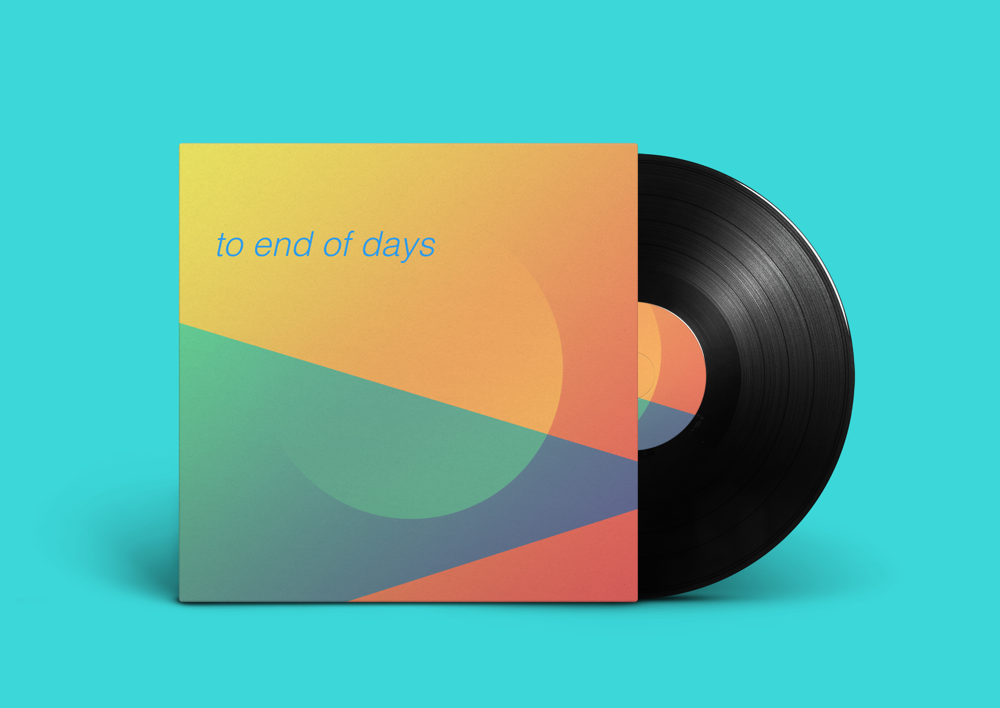

**to end of days** is an arrangement for concert band of selections from Howard Shore's Lord of the Rings Soundtrack.  

Scored for:
 - flute
 - oboe
 - Bb clarinet
 - alto sax
 - tenor sax
 - french horn
 - Bb trumpet
 - trombone
 - baritone
 - tuba
 - double bass
 - timpani, suspended cymbals, bells

You can <a href="https://github.com/theresama/to-end-of-days" target="_parent">download the score & individual parts on my GitHub</a>, as well as an audio sample. 

<b>Part 1 (~3mins):</b> The Riders of Rohan into Breaking of the Fellowship (In Dreams)
 
<b>Part 2(~9mins):</b> Forth Eorlingas, The White Tree, The Riders of Rohan, The Ring Goes South, The Breaking of the Fellowship (In Dreams)

