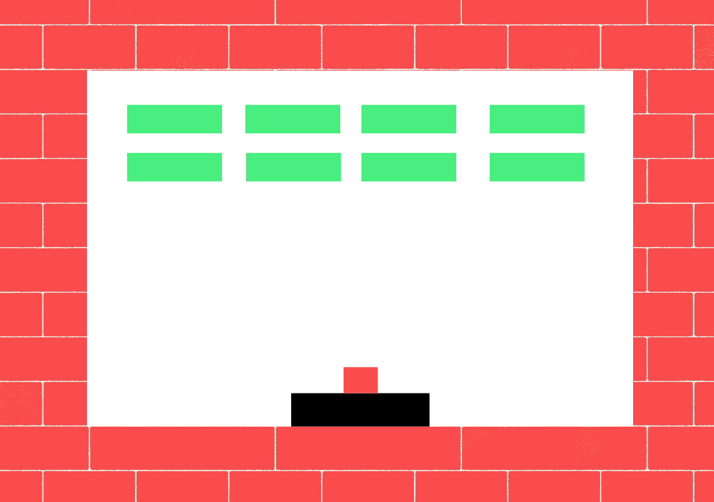

  Classic brick breaker arcade game implemented using Verilog Hardware Description Language, built for the Altera DE2 FPGA. Features three difficulty levels and start/pause/restart functions. 
    
  Developed with a partner as the final project for CSC258H1 to demonstrate finite state machines, synchronous circuits, sequential circuits, and operations with signed binary. I was responsible for the movement of the ball, paddle, and collision detection.
    
  Available on <a href="https://github.com/theresama/another-brick-in-the-wall" target="_parent">GitHub</a>

