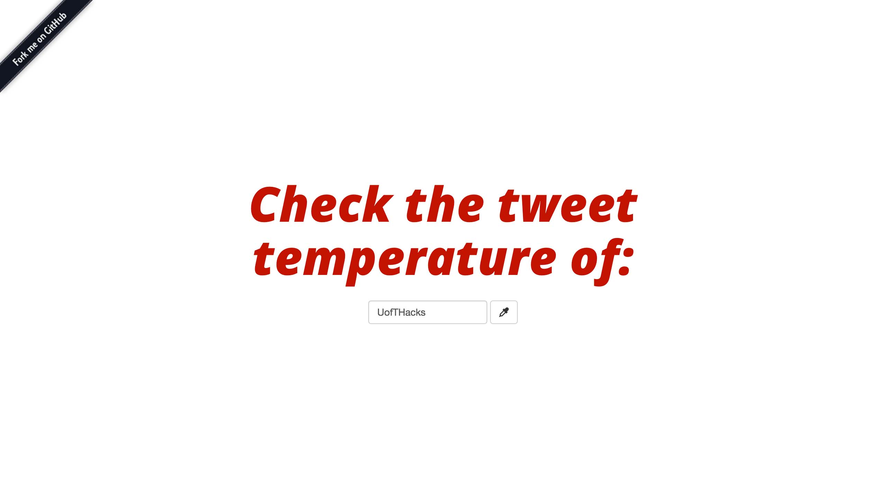
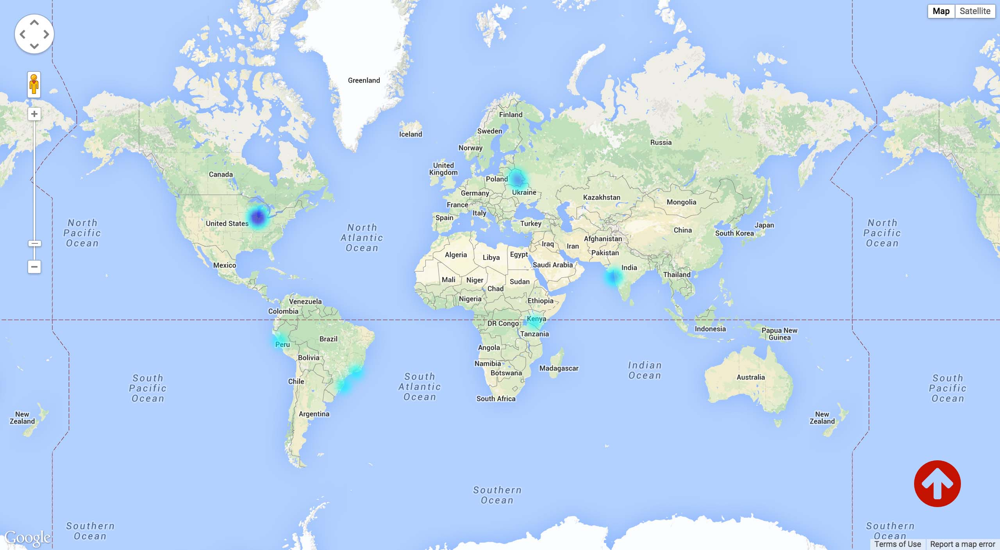

First of all, [Celton McGrath](http://github.com/celtonmcgrath) is amazing for being my partner through the hackathon; he's one of the smartest people I've ever met and a total saint for putting up with sleep deprived Theresa. & thank you to the whole U of T Hacks team + volunteers for organizing this (& especially for the poutine lunch).

**What we wanted to make:** We live in such a globally connected community through our social networks, so it'd be cool to analyze some data from Twitter and discover how "globally minded" people are, from around the world, and rank countries based on how aware they are of happenings that are geographically far away. For example, if a major event is happening in France, which other places in the world care about what's going on? 

**What we actually made:** A heat map visualization of tweets from around the world, on a specific topic & in real time. We realize this has probably (definitely) been done before, but we wanted to make it anyway, just for the sake of learning something new while making something (we think is) cool.

> Technologies used:
> 
>  - Node.js (with [express](http://expressjs.com/) & [socket.io](http://socket.io/))
>  - Twitter streaming API (using [twit](https://github.com/ttezel/twit))
>  - Google Maps Javascript API

For both of us, this was the first time using any of those, so it was totally cool to get started learning something new. 

The biggest challenge was definitely setting up the sockets to stream the tweets. We started with using [node-twitter](https://github.com/desmondmorris/node-twitter) as our client library, but about halfway through the hackathon, we couldn't figure out how to use it to close the stream and initiate a new one when the user requests a new topic search. We ended up looking through the library and we're pretty sure there's a `//FIXME` comment on that part of it, so we switched to using [twit](https://github.com/ttezel/twit), and it was beautiful. If anyone reading this knows how it could've worked with node-twitter, [please let me know](mailto:theresa01.ma@gmail.com?subject=node-twitter)!

You can check it out [here on Github](https://github.com/theresama/tweet-heat) and have some fun looking at a heat map & reading the tweets that stream into your terminal.

We also set up a demo on an Amazon EC2 server, so you can take a look at [tweetheat.me](http://tweetheat.me), but only one Twitter API request can be made at a time, so here's to hoping no one else is on it when you are? I'm also not too sure how problematic of a security issue it is that we've included a dev token in the demo, so don't be evil & someone please let me know if this is foolish. 

Even though we didn't get to analyze the tweet data or events as we were hoping to, #HackItShipIt!!! 

(honestly tho, this is a screenshot of #HappyBirthdayHarryStyles tweets streaming in for about 30 seconds, which was the worldwide #1 trend for most of the whole day)

