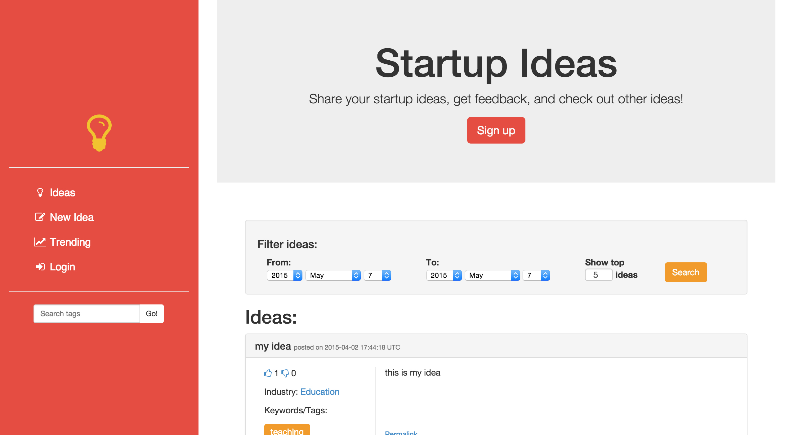

This is a small app built upon Ruby on Rails for users to share and collaborate on their startup ideas, created as individual coursework for CSC309 Programming on the Web.
  
<a href="http://ideas.theresa-ma.com">View live deploy</a>
 
<a href="https://github.com/theresama/share-ideas">View on GitHub</a>

